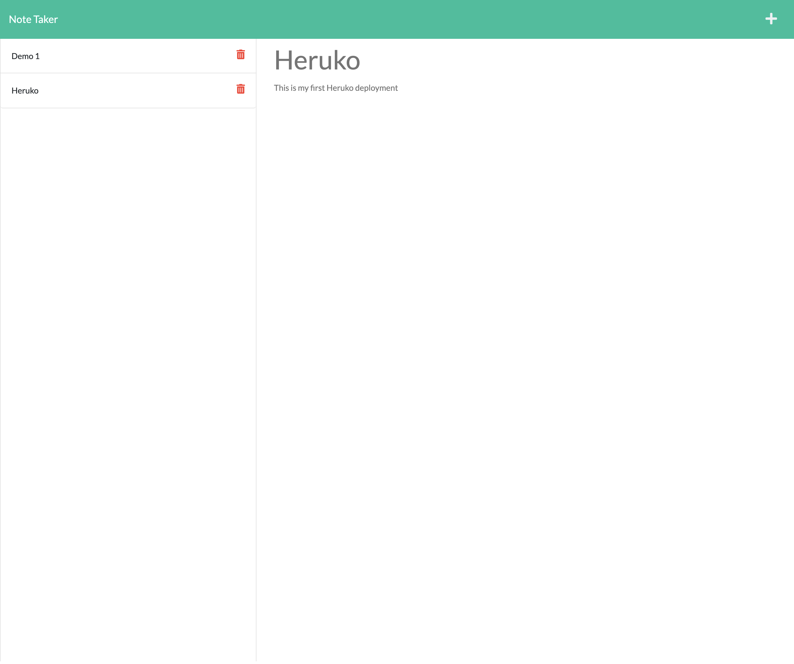
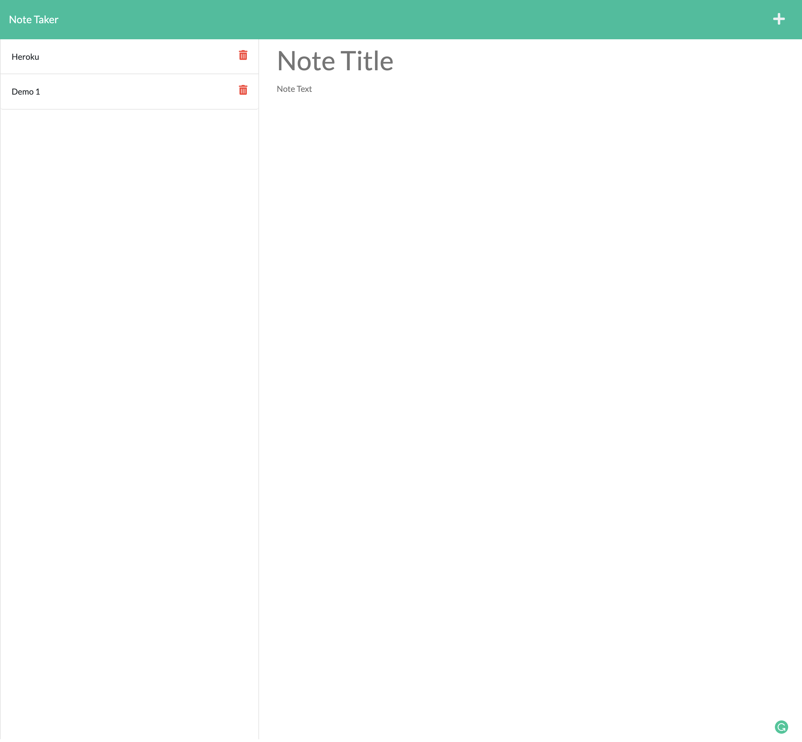

# Note-Taker

## Table of content

- [Description](#description)
- [Installation](#installation)
- [Usage](#usage)
- [License](#license)
- [Contributing](#contributiing)
- [Test](#test)
- [Questions](#questions)
- [Screenshots](#screenshots)
- [Links](#links)
- [Screenshot](#screenshot)

## Description

## Installation

```
1. git clone from my repo: https://github.com/bongomin256/Note-Taker .
2. cd to the directory you have cloned.
3. npm install express.
4. npm install uuid.
```

## Usage

This application helps user organise their thoughts and keep track of tasks needed to be completed.

## License

.
The license's link [MIT](https://opensource.org/licenses/MIT)

## Contribution

Connect with me through my [Github profile](https://github.com/bongomin256) or [E-mail](bongomin@uw.edu) in order to contribute to this project.

## Test

You have to download and and install nodejs inorderto be able to run this application. Also you need to install express module.

## Questions

This is the link to my [Github profile](https://github.com/bongomin256)
Incase of any question[s] or suggestion[s] concerning this appication, please contact me through this email [bongomin@uw.edu](bongomin@uw.edu)

## Links

- [Github app repo](https://github.com/bongomin256/Note-Taker)
- [Link to heroku deployed application](https://polar-inlet-97510.herokuapp.com/)

## Screenshots



